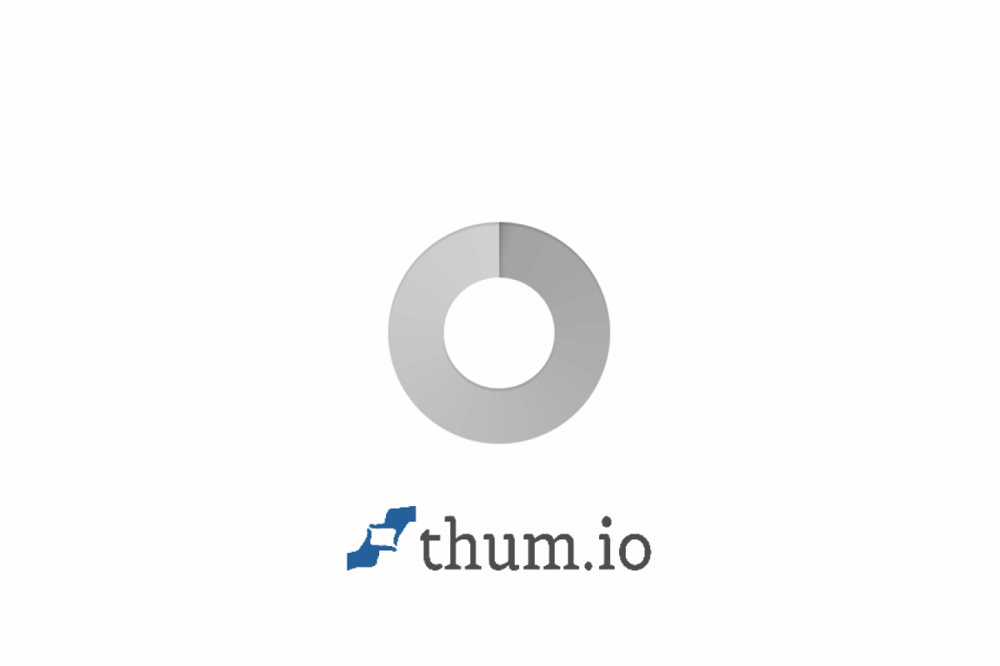

# Lumina Travel Application

## Overview
Lumina Travel is a premium, modern editorial travel web application designed to help users explore destinations around the world. It features real-time weather, location awareness, AI-powered travel assistance, and dynamic image fetching to provide a rich user experience.

## Features
- **Landing Experience**: Stunning hero section with a looping background travel video.
- **Destination Explorer**: Browse, search, and filter a curated list of global destinations.
- **Location Awareness**: Uses the browser's Geolocation API to fetch and display local weather, with a manual city search fallback.
- **Real-Time Weather**: Integrates OpenWeather API to show current conditions, temperature, humidity, and wind speed.
- **Dynamic Imagery**: Fetches high-quality destination and famous place images dynamically via Pexels API.
- **AI Travel Assistant**: Conversational chatbot powered by Google Gemini to answer destination-specific questions.
- **Itinerary Planning**: Automatically generates a structured, day-by-day travel itinerary using AI based on user preferences and duration.

## Tech Stack
- **Framework**: React 18
- **Build Tool**: Vite
- **Routing**: React Router DOM
- **Styling**: Vanilla CSS (CSS variables, modern layout techniques, fully custom design system without utility frameworks)
- **Icons**: Lucide React

## APIs Used
- **Google Gemini API**: For the intelligent chatbot and itinerary generation.
- **OpenWeather API**: For real-time weather data based on coordinates or city names.
- **Pexels API**: For fetching dynamic destination imagery.

## Project Structure
```
src/
  components/    # Reusable UI components (Navbar, Cards, Chatbot, etc.)
  pages/         # Route components (Home, Explore, DestinationDetails)
  services/      # API integrations (aiService.js, weatherService.js, imageService.js)
  data/          # Static destination data and configuration
  hooks/         # Custom React hooks (useLocation)
  assets/        # Static assets
  App.jsx        # Routing setup
  index.css      # Global CSS variables and design system
```

## Setup Instructions

### Prerequisites
- Node.js (v18 or higher)
- npm or yarn

### Environment Variables
Create a `.env` file in the root directory and add the following keys:
```env
VITE_GEMINI_API_KEY=your_gemini_api_key_here
VITE_OPENWEATHER_API_KEY=your_openweather_api_key_here
VITE_PEXELS_API_KEY=your_pexels_api_key_here
```
*Note: If keys are missing, the app has graceful fallbacks (e.g., placeholder images, disabled features).*

### Running Locally
1. Install dependencies:
   ```bash
   npm install
   ```
2. Start the development server:
   ```bash
   npm run dev
   ```
3. Open `http://localhost:5173` in your browser.

## Build
To create a production build:
```bash
npm run build
```
This will output optimized files to the `dist` directory.

## Deployment
The app can be deployed to any static hosting provider like Vercel, Netlify, or GitHub Pages. Just ensure environment variables are configured in the hosting provider's dashboard.

## How It Works

### AI Assistant & Itinerary (Gemini)
The app uses the Gemini 1.5 Flash model via REST API. 
- For the **chatbot**, it maintains conversation history in state and sends it as context along with the destination details to provide relevant answers.
- For the **itinerary**, it constructs a strict system prompt instructing Gemini to return a structured JSON response. The frontend then parses this JSON to render beautifully formatted React components instead of a raw block of text.

### Weather (OpenWeather)
The weather service fetches data using latitude and longitude coordinates. If coordinates are unavailable, it falls back to fetching by city name. It gracefully handles loading and error states.

### Location Awareness
The `useLocation` custom hook wraps the browser's Geolocation API. If the user grants permission, it fetches their coordinates. If denied, the app continues to function normally and allows manual location entry.

## Screenshots




